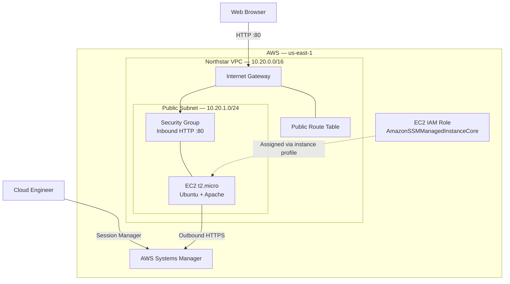

```mermaid
flowchart TB
    User["Web Browser"] -->|HTTP :80| IGW["Internet Gateway"]

    subgraph AWS["AWS — us-east-1"]
        subgraph VPC["Northstar VPC — 10.20.0.0/16"]
            IGW
            RT["Public Route Table"]
            subgraph Subnet["Public Subnet — 10.20.1.0/24"]
                EC2["EC2 t2.micro<br/>Ubuntu + Apache"]
                SG["Security Group<br/>Inbound HTTP :80"]
            end
            IGW --- RT
            SG --- EC2
        end
        SSM["AWS Systems Manager"]
        IAM["EC2 IAM Role<br/>AmazonSSMManagedInstanceCore"]
    end

    Engineer["Cloud Engineer"] -->|Session Manager| SSM
    EC2 -->|Outbound HTTPS| SSM
    IAM -.->|Assigned via instance profile| EC2
    IGW --> SG
```
